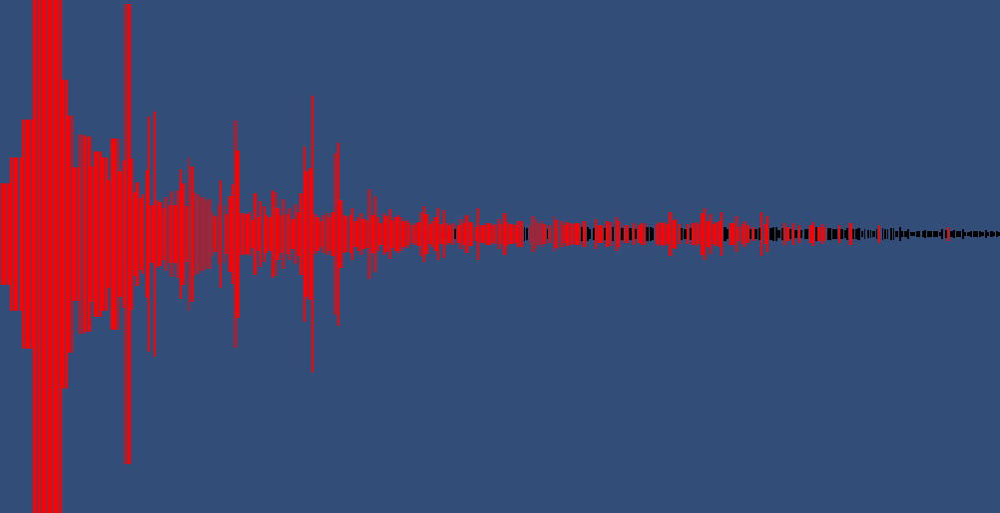
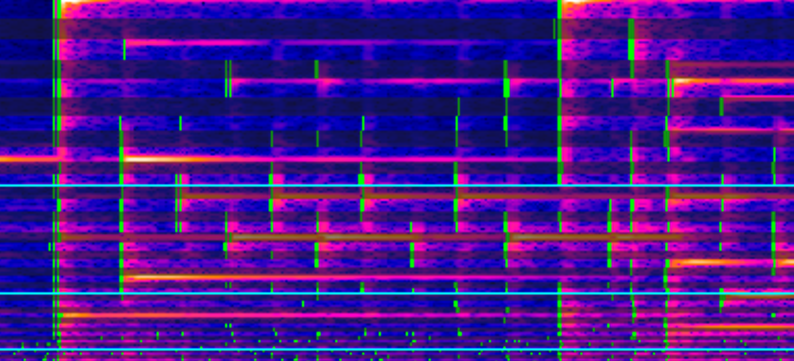

# MusicGame
A game made in unity that can translate musical input(any raw CPM data) into playable notes. Making for hopefully a fun interactive 

## How does it work?
It uses a built in FFT to gather the frequency data of a song in real time. With that data you can determine which frequencies hold what could be considered active notes. These are then displayed to the screen in the form of playable notes.

You can visit [my theories page](Theory.md) to view my whole thought process and notes.

## More tools
To work out magic numbers and make sure its all working properly I construct an image from this real time frequency data showing it like a spectrogram, then I can draw marks on that to show where it thinks active notes are.

## Audio Analysis
Fourier Transformation (FFT)

 
 
Spectrogram generation

 
 
 Note Differentiation
 
 
