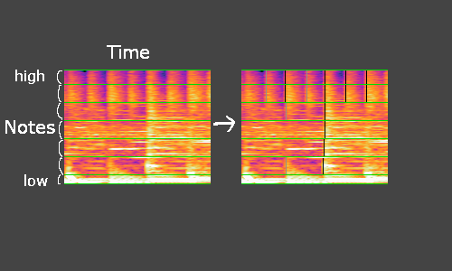
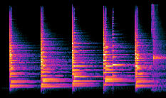
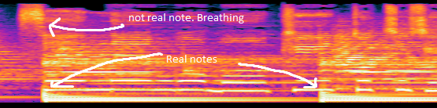
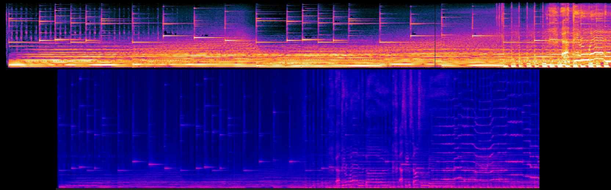
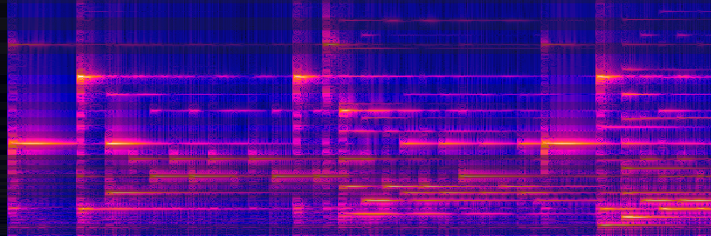

## Theory

Using the input PCM data represented by an array of floats(R[0-1023] - L[1024-2047]), I can get a live representation in the form of an oscillogram.
With this I can try to detect patterns between the frequencies to determine when the audio is 'impactful'.


### Facts for PCM:
* Low sounds are represented by few wide waves/groups
* High sounds are represented by many skinny waves/groups

### Facts for FreqDomain:
* start of a note cant be denoted by a peaked high frequency (some notes may drag out and will stay high/slowly get lower)
* the raw data float[2048] = index: 0-2047, freq: 20-20k (tested this). Each record is about 9.75hz higher than the previous

### Patterns to detect/use:
* BPM
* Total number of groups
* How wide each group is
* Average height of each group
* How many outliers in the group
* Which frequencies does this group span
* total volume/energy (see below)

### Impactful audio:
* Should be inline with BPM
* More frequent for faster music
* Base drops

### Total Energy/Loudness: [link](https://dsp.stackexchange.com/questions/2951/loudness-of-pcm-stream/2953#2953)
* Use RMS to find total energy


### FFT(Fourier Transform): [link](https://www.codeproject.com/KB/audio-video/SoundViewer.aspx)
* converts time domain data into seperate frequencies. This can then be converted into a frequency domain
* Unity has a built in FFT: `AudioListener.GetSpectrumData(audioInfoRaw, 0, FFTWindow.Rectangular);`


```
// PCM DATA
private void OnAudioFilterRead(float[] data, int channels) {
    if (!fetchRawAudio) return;
    audioInfoRaw = data;
    fetchRawAudio = false;
}
```


[Should I use fmod audio](https://www.fmod.com/docs/2.01/unity/user-guide.html)? seems like it may be more of an audio editor

[Maybe this](https://discussions.unity.com/t/how-to-do-a-fft-in-unity/139527/3)

### Random thoughts
 * use a better fft instead of unitys
 * "The Mel scale represents frequency space linearly up to 700 Hz and logarithmically above that, mimicking how humans perceive pitch space"

## From the top:

 * I get frequency amplitude per each frame. We'll call each of these a `frequencyFrame`
 * FOR EACH frequencyFrame:
    * divide the frequencyFrame into the 9 `octaves` according to [this chart](https://mixbutton.com/music-tools/frequency-and-pitch/music-note-to-frequency-chart). (you might be able to scrap some of the edge octaves)
    * FOR EACH of the octaves:
        * divide the octave into 7 `notes`, once again according to the chart
        * each of these notes will hold the `highest frequency` in its frequency range, as well as the `average`
        * FOR EACH note:
            * compare it with the equivilent notes in a stored `noteArrayBuffer` (a few previous slices of frequencyFrames)
            * this is an `activeNote` IF:
                * this note is much higher than the buffered ones. (whether it be highest freq or higher average)
                * this note is higher than both the neighboring notes ( if the average is about the same there could be 2 active notes right next to eachother)
        * store this new note array in the buffer
 *** Try showing this information directly first, but it might have timing problems in which case do the below ***

 * Once you have all active notes you can determine if theyre a `shownNote` IF:
    * //it lines up with the bpm (for major notes)
    * a note from this frequency hasnt been played in n ms
    * there arent many other shown notes in this `shownNotesSection`
 * a shown notes section is a row of notes which hold the tiles you will physically click ( ultimately the notes have to have some kind of spacing so the player isnt overwhelmed notes at nearly the same time) (these sections should move somewhat with the bpm). If there are ever consecutive active notes, choose only the middle one to be displayed?

.

#### Notes to be generated over time:
 * green bars represent different note sections
 * black lines represent active notes (grey is potentially active)



#### Straight forward notes to detect
 

#### Though some notes may be active, they might not be played if its not lined up with bpm
 


#### My spectrogram progress (Audacity's vs Mine)
 
 

#### Note seperation on the spectrogram
 