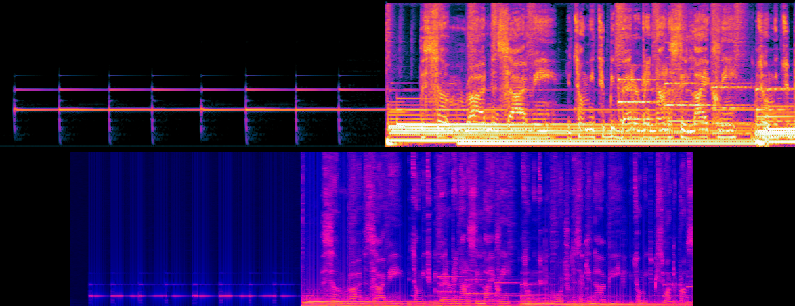

## Theory

Using the input PCM data represented by an array of floats(R[0-1023] - L[1024-2047]), I can get a live representation in the form of an oscillogram.
With this I can try to detect patterns between the frequencies to determine when the audio is 'impactful'.


### Facts for PCM:
* Low sounds are represented by few wide waves/groups
* High sounds are represented by many skinny waves/groups

### Facts for FreqDomain:
* start of a note cant be denoted by a peaked high frequency (some notes may drag out and will stay high/slowly get lower)
* the raw data float[2048] = index: 0-2047, freq: 20-20k (tested this). Each record is about 9.75hz higher than the previous

### Patterns to detect/use:
* BPM
* Total number of groups
* How wide each group is
* Average height of each group
* How many outliers in the group
* Which frequencies does this group span
* total volume/energy (see below)

### Impactful audio:
* Should be inline with BPM
* More frequent for faster music
* Base drops

### Total Energy/Loudness: [link](https://dsp.stackexchange.com/questions/2951/loudness-of-pcm-stream/2953#2953)
* Use RMS to find total energy


### FFT(Fourier Transform): [link](https://www.codeproject.com/KB/audio-video/SoundViewer.aspx)
* converts time domain data into seperate frequencies. This can then be converted into a frequency domain
* Unity has a built in FFT: `AudioListener.GetSpectrumData(audioInfoRaw, 0, FFTWindow.Rectangular);`


```
// PCM DATA
private void OnAudioFilterRead(float[] data, int channels) {
    if (!fetchRawAudio) return;
    audioInfoRaw = data;
    fetchRawAudio = false;
}
```


[Should I use fmod audio](https://www.fmod.com/docs/2.01/unity/user-guide.html)? seems like it may be more of an audio editor

[Maybe this](https://discussions.unity.com/t/how-to-do-a-fft-in-unity/139527/3)


## From the top:

 * I get frequency loudness per each frame. Well call each of these a `frequencyFrame`
 * FOR EACH frequencyFrame:
    * divide the frequencyFrame into n sections which will represent n different `notes`.         (imagine it as compacting the 1024 channels into n notes instead)
    * each of these notes will hold the `highest frequency` of all frequencies in that section as well as the `average`
    * FOR EACH note:
        * compare it with the equivilent notes in a stored `noteArrayBuffer` (a matrix of notes, low to high in each array. And each array seperated by time between frames)
        * this is an `activeNote` IF:
            * this note is much higher than the buffered ones.
 * store this new note array in the buffer
 *** Try showing this information directly first, but it might have timing problems in which case do the below ***

 * Once you have all active notes you can determine if theyre a `shownNote` IF:
    * it lines up with the bpm (for major notes)
    * a note from this frequency hasnt been played in n ms
    * there arent many other shown notes in this `shownNotesSection`
 * a shown notes section is a row of notes which hold the tiles you will physically click ( ultimately the notes have to have some kind of spacing so the player isnt overwhelmed notes at nearly the same time) (these sections should move somewhat with the bpm)

.

#### Notes to be generated over time:
 * green bars represent different note sections
 * black lines represent active notes (grey is potentially active)


#### Straight forward notes to detect
 

#### Though some notes may be active, they might not be played if its not lined up with bpm
 


#### My spectrogram progress (Audacity's vs Mine)
 
 